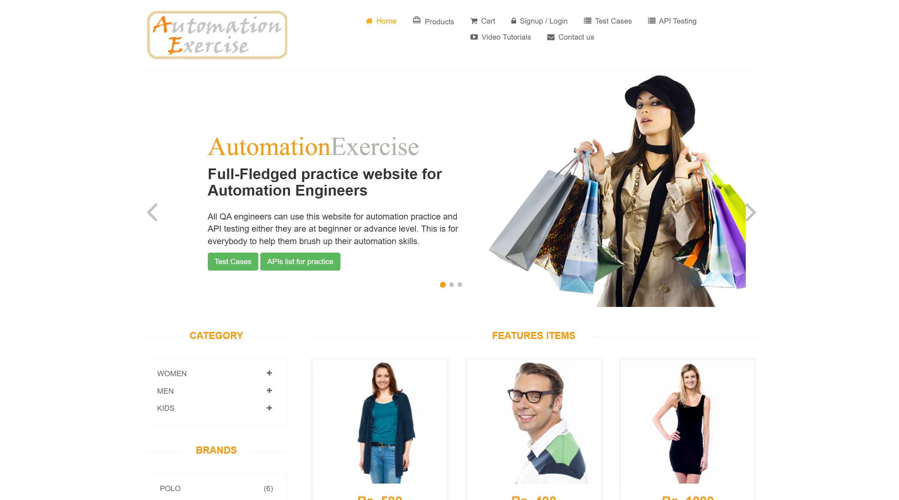
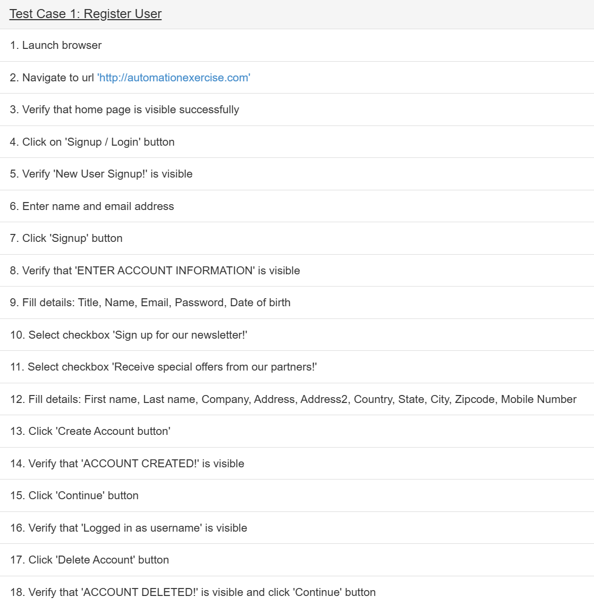
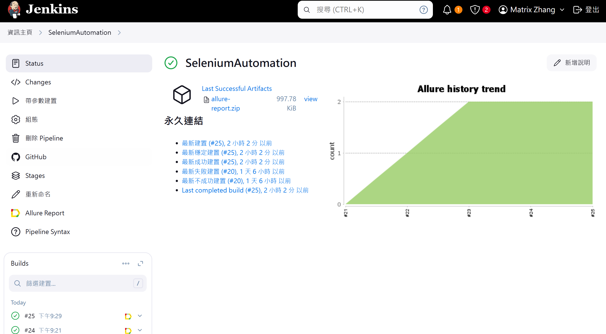
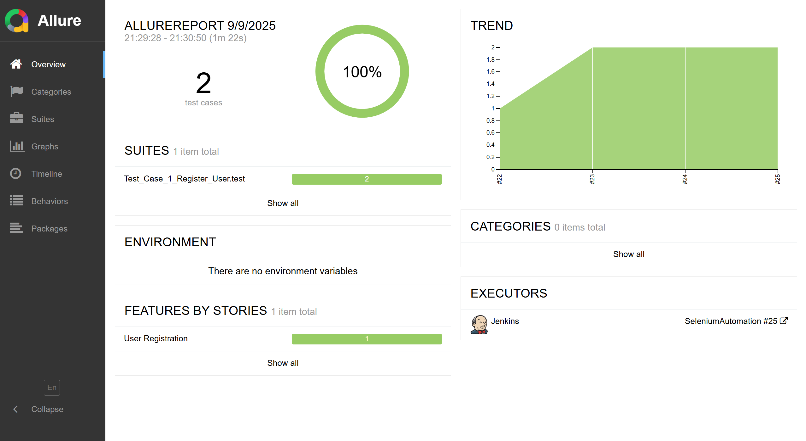
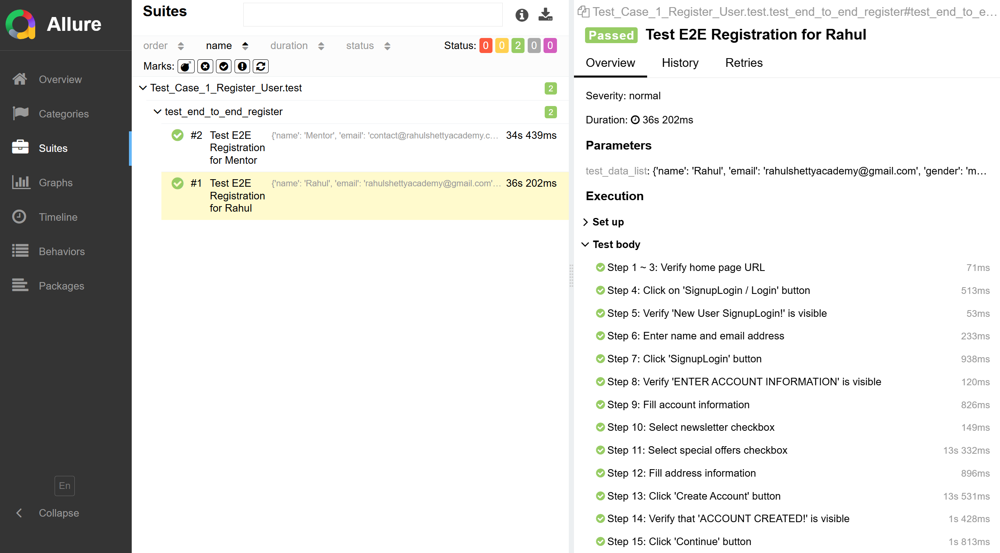
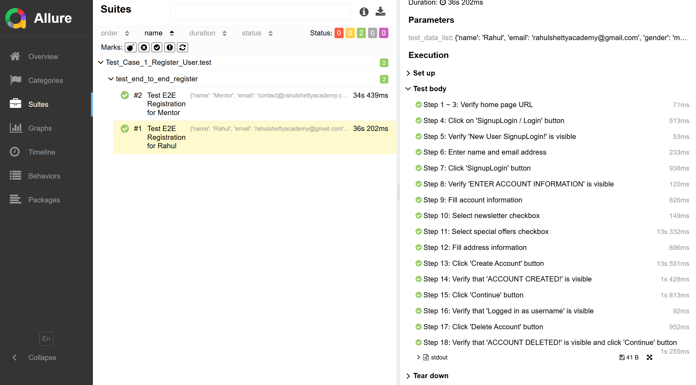

# 🚀 Selenium Automation Testing Framework

[](https://www.python.org/)
[](https://www.selenium.dev/)
[](https://docs.pytest.org/)

🌐 **Test Website**: [Automation Exercise](https://www.automationexercise.com/)  



## 📋 Project Overview

A full-featured web automation testing framework built with **Python + Selenium + Pytest + Allure + Jenkins**, focused on automating e-commerce workflows.
Covers end-to-end scenarios like user registration, login, product search, add-to-cart, and checkout.
Test scripts are written based on actual test cases provided by the website.

## 🎥 Demo Video

👉 [Watch Demo on Google Drive](https://drive.google.com/file/d/1bNTyvdDiwEorj8R1WAfAD__ml3GZUSTD/view?usp=drive_link)

## 🏗️ Project Structure

```
SeleniumAutomation/
├── API_*_*/        # API automation test cases
│   ├── report
│   │     └──allure-results
│   └── test
│         └──__init__.py
│         └──test_*.py
│
├── page_object/    # Page Object Model (POM)
│        └──__init__.py
│        └──page_factory.py 
│        └── ...    
│
├── assets/  
│   └── image
│        └──*.png
│
├── config/         # Configuration files
│        └──__init__.py
│        └──config.py  
│
├── browser_utils/  # Browser interaction utilities
│        └──__init__.py
│        └──browser_utils.py 
│
├── Test_Case_*/    # Web automation test cases
│   ├── page_object
│   │    └──test_data_folder
│   │       └──test_data.json
│   │
│   ├── screenshots
│   ├── report
│   │     └──allure-results
│   └── test
│         └──__init__.py
│         └──test_*.py  
│   
├── conftest.py     # Pytest configuration
├── .gitignore
├── __init__.py
├── Jenkinsfile
├── requirements.txt
├── setup.py
├── .pytest.ini 
├── README_CN.md     
└── README.md
```
## 🏗️ Design Highlights:
* Based on the **Page Object Model (POM)** design pattern.
* Each test case includes its own *page_object*, *report*, *screenshots*, and *test* folders.
* *page_object* encapsulates UI elements and operations into reusable classes.
* JSON test data is stored under *test_data_folder* for relevant test cases.
* Failed test screenshots are saved in *screenshots/*.
* Allure test results are stored in *report/*.
* Test scripts follow step-by-step definitions based on official test scenarios.
* *browser_utils* contains shared browser utility functions across tests.

## 🌟 Key Features:
* Easy to maintain and scale using **POM**.
* Centralized *page_factory* to manage and initialize all page objects via fixtures.
* Custom *safe_click()* and *aggressive_safe_click()* to handle loading delays and ad overlays.
* Remove full/partial iframe ads via JavaScript.
* Capture critical screenshots upon test failure.
* Supports both headless and headed modes.
* Cross-browser support for **Brave**, **Chrome**, **Edge**, and **Firefox**.
* Standalone test scripts that load data dynamically via config.py — non-devs can also run tests.
* Allure reports use *@feature*, *@story*, *@title*, and *allure.step* to reflect each test case clearly.
* Allure steps match the real test cases exactly — helpful for debugging.
* Invoice verification is automated after adding products to cart.
* CI-ready: integrated with Jenkins to allow selective test execution based on UI input.


## 🛠️ Tech Stack

### Core Technologies
- **Language**: Python 3.13
- **Automation Framework**: Selenium 4.31.0
- **Testing**: Pytest 8.4.0
- **Reporting**: Allure 2.15.0
- **CI/CD**: Jenkins 2.479.1 (Java 17)

### Browser Support
- Brave (Recommended)
- Chrome
- Edge
- Firefox

### Development Tools
- **IDE**: PyCharm Professional 2025.2.1.1
- **API Testing**: Postman 11.61.10
- **CI/CD**: Jenkins 2.479.1

### Environment
- Windows 11
- openjdk version "21.0.2" 2024-01-16
- Jenkins allure plugin

### Version Control
- Git


--- 
## 🚀 Quick start（Local developer use）

### Requirement
- Python 3.8+
- Brave/Chrome/Edge/Firefox browser
- ChromeDriver/EdgeDriver/GeckoDriver

### Installation

1. **Clone project**
```bash
git clone https://github.com/matrixzhang98/SeleniumAutomation.git
cd SeleniumAutomation
```

2. **Create virtual environment** (recommended)
```bash
python -m venv venv

# Windows
.\venv\Scripts\activate

# Linux/Mac
source venv/bin/activate
```

3. **Install dependencies**
```bash
# update pip
pip install --upgrade pip

# install project dependencies
pip install -r requirements.txt

# install project packages
pip install .
```

### 🎯 Running Tests

#### Method 1: Run a Single Test Case
```bash
# Basic syntax
# TEST_FILE number must match TEST_CASE number
pytest <TEST_FILE>.py --browser_name=<browser> [--headless] --alluredir=<TEST_CASE>/report/allure-results

# Example: Run user registration test using Chrome
pytest Test_Case_1_Register_User/test/test_end_to_end_register.py --browser_name=chrome

# Example: Run login test using Brave in headless mode
pytest Test_Case_2_Login_User_with_correct_email_and_password/test/test_login_with_correct_info.py --browser_name=brave --headless
```

#### Method 2: Run API Tests
```bash
# Example: Run product list API test
pytest API_1_Get_All_Products_List/test/test_get_all_products_list.py --browser_name=chrome
```

#### Method 3: Generate Allure Test Report
```bash
# Run test and generate Allure result files
pytest Test_Case_1_Register_User/test/test_end_to_end_register.py --browser_name=chrome --alluredir=Test_Case_1_Register_User/report/allure-results

# View test report (Allure must be installed)
allure serve Test_Case_1_Register_User/report/allure-results
```

#### Method 4: Run API Tests and Generate Allure Report
```bash
pytest API_1_Get_All_Products_List/test/test_get_all_products_list.py --alluredir=API_1_Get_All_Products_List/report/allure-results

allure serve Test_Case_1_Register_User/report/allure-results
```

### 🔧 Available Parameters

| Parameter        | Options                              | Description                                 |
|------------------|--------------------------------------|---------------------------------------------|
| `--browser_name` | `brave`, `chrome`, `edge`, `firefox` | Specify browser for testing                 |
| `--headless`     | `normal`, `headless`                 | Enable headless mode (no UI browser window) |

### 📁 Test Case List

#### TEST_CASE
- `Test_Case_1_Register_User`
- `Test_Case_2_Login_User_with_correct_email_and_password`
- `Test_Case_3_Login_User_with_incorrect_email_and_password`
- `Test_Case_4_Logout_User`
- `Test_Case_5_Register_User_with_existing_email`
- `Test_Case_6_Contact_Us_Form`
- `Test_Case_7_Verify_Test_Cases_Page`
- `Test_Case_8_Verify_All_Products_and_product_detail_page`
- `Test_Case_9_Search_Product`
- `Test_Case_10_Verify_Subscription_in_home_page`
- `Test_Case_11_Verify_Subscription_in_Cart_page`
- `Test_Case_12_Add_Products_in_Cart`
- `Test_Case_13_Verify_Product_quantity_in_Cart`
- `Test_Case_14_Place_Order_Register_while_Checkout`
- `Test_Case_15_Place_Order_Register_before_Checkout`
- `Test_Case_16_Place_Order_Login_before_Checkout`
- `Test_Case_17_Remove_Products_From_Cart`
- `Test_Case_18_View_Category_Products`
- `Test_Case_19_View_and_Cart_Brand_Products`
- `Test_Case_20_Search_Products_and_Verify_Cart_After_Login`
- `Test_Case_21_Add_review_on_product`
- `Test_Case_22_Add_to_cart_from_Recommended_items`
- `Test_Case_23_Verify_address_details_in_checkout_page`
- `Test_Case_24_Download_Invoice_after_purchase_order`
- `Test_Case_25_Verify_Scroll_Up_using_Arrow_button_and_Scroll_Down_functionality`
- `Test_Case_26_Verify_Scroll_Up_without_Arrow_button_and_Scroll_Down_functionality`
- `API_1_Get_All_Products_List`
- `API_2_POST_To_All_Products_List`
- `API_3_Get_All_Brands_List`
- `API_4_PUT_To_All_Brands_List`
- `API_5_POST_To_Search_Product`
- `API_6_POST_To_Search_Product_without_search_product_parameter`
- `API_7_POST_To_Verify_Login_with_valid_details`
- `API_8_POST_To_Verify_Login_without_email_parameter`
- `API_9_DELETE_To_Verify_Login`
- `API_10_POST_To_Verify_Login_with_invalid_details`
- `API_11_POST_To_Create_Register_User_Account`
- `API_12_DELETE_METHOD_To_Delete_User_Account`
- `API_13_PUT_METHOD_To_Update_User_Account`
- `API_14_GET_user_account_detail_by_email`

#### TEST_FILE - Web Automation Tests (26 Cases)
- `Test_Case_1_Register_User/test/test_end_to_end_register`
- `Test_Case_2_Login_User_with_correct_email_and_password/test/test_login_with_correct_info`
- `Test_Case_3_Login_User_with_incorrect_email_and_password/test/test_incorrect_user_info`
- `Test_Case_4_Logout_User/test/test_logout`
- `Test_Case_5_Register_User_with_existing_email/test/test_exist_user`
- `Test_Case_6_Contact_Us_Form/test/test_contact_us`
- `Test_Case_7_Verify_Test_Cases_Page/test/test_go_test_cases`
- `Test_Case_8_Verify_All_Products_and_product_detail_page/test/test_verify_all_products`
- `Test_Case_9_Search_Product/test/test_search_product`
- `Test_Case_10_Verify_Subscription_in_home_page/test/test_subscription_in_home_page`
- `Test_Case_11_Verify_Subscription_in_Cart_page/test/test_subscription_in_cart_page`
- `Test_Case_12_Add_Products_in_Cart/test/test_add_products_in_cart`
- `Test_Case_13_Verify_Product_quantity_in_Cart/test/test_quantity_in_cart`
- `Test_Case_14_Place_Order_Register_while_Checkout/test/test_place_order_register_while_checkout`
- `Test_Case_15_Place_Order_Register_before_Checkout/test/test_place_order_register_before_checkout`
- `Test_Case_16_Place_Order_Login_before_Checkout/test/test_place_order_login_before_checkout`
- `Test_Case_17_Remove_Products_From_Cart/test/test_remove_products_from_cart`
- `Test_Case_18_View_Category_Products/test/test_view_category_products`
- `Test_Case_19_View_and_Cart_Brand_Products/test/test_view_and_cart_brand_products`
- `Test_Case_20_Search_Products_and_Verify_Cart_After_Login/test/test_search_products_and_verify_cart_after_login`
- `Test_Case_21_Add_review_on_product/test/test_add_review_on_product`
- `Test_Case_22_Add_to_cart_from_Recommended_items/test/test_add_to_cart_from_recommended_items`
- `Test_Case_23_Verify_address_details_in_checkout_page/test/test_verify_address_details_in_checkout_page`
- `Test_Case_24_Download_Invoice_after_purchase_order/test/test_download_invoice_after_purchase_order`
- `Test_Case_25_Verify_Scroll_Up_using_Arrow_button_and_Scroll_Down_functionality/test/test_verify_scroll_up_using_arrow_button_and_scroll_down_functionality`
- `Test_Case_26_Verify_Scroll_Up_without_Arrow_button_and_Scroll_Down_functionality/test/test_verify_scroll_up_without_arrow_button_and_scroll_down_functionality`

#### TEST_FILE - API Automation Tests (14 Cases)
- `API_1_Get_All_Products_List/test/test_get_all_products_list`
- `API_2_POST_To_All_Products_List/test/test_post_to_all_products_list`
- `API_3_Get_All_Brands_List/test/test_get_all_brands_list`
- `API_4_PUT_To_All_Brands_List/test/test_put_to_all_brands_list`
- `API_5_POST_To_Search_Product/test/test_post_to_search_product`
- `API_6_POST_To_Search_Product_without_search_product_parameter/test/test_post_to_search_product_without_search_product_parameter`
- `API_7_POST_To_Verify_Login_with_valid_details/test/test_post_to_verify_login_with_valid_details`
- `API_8_POST_To_Verify_Login_without_email_parameter/test/test_post_to_verify_login_without_email_parameter`
- `API_9_DELETE_To_Verify_Login/test/test_delete_to_verify_login`
- `API_10_POST_To_Verify_Login_with_invalid_details/test/test_post_to_verify_login_with_invalid_details`
- `API_11_POST_To_Create_Register_User_Account/test/test_post_to_create_register_user_account`
- `API_12_DELETE_METHOD_To_Delete_User_Account/test/test_delete_method_to_delete_user_account`
- `API_13_PUT_METHOD_To_Update_User_Account/test/test_put_method_to_update_user_account`
- `API_14_GET_user_account_detail_by_email/test/test_get_user_account_detail_by_email`


### 💡 Usage Tips

1. **First Time Execution**: It is recommended to start with `Test_Case_1_Register_User` to test user registration functionality.
2. **Browser Preference**: Best performance with Brave browser, followed by Chrome.
3. **Headless Mode**: Use `--headless` when running in CI/CD environments.
4. **Test Reports**: Each test run will generate results under the corresponding `report/allure-results` directory.
5. **Screenshot Feature**: Failed tests will automatically capture screenshots and save them in the `screenshots` directory.

--- 
## 🧪 Run Automated Tests with Jenkins (For CI/CD Deployers)

This project integrates with Jenkins Pipeline. After cloning, you can directly deploy and run.

### Steps:

#### 1️⃣ Make sure Jenkins has the following plugin installed:
- **Allure Jenkins Plugin**

#### 2️⃣ Create a Jenkins Job
1. Log into Jenkins
2. Click **"New Item"** > Enter a name (e.g. **SeleniumAutomation**)
3. Choose **Pipeline Project**
4. In the "Pipeline" section:
    - **Pipeline script from SCM**
    - SCM: `Git`
    - Repository URL: `https://github.com/matrixzhang98/SeleniumAutomation.git`
    - Branch: `master`
5. Save

#### 3️⃣ Configure Pipeline Parameters
When executing the job, choose the following parameters to control test behavior:

- `BROWSER`：Browser to use for testing (e.g., brave, chrome, etc.)
- `HEADLESS`：Whether to use headless mode (e.g., normal, headless)
- `TEST_CASE`：Test case directory
- `TEST_FILE`：The actual test file to execute

> ✅ All available parameters are defined in the `Jenkinsfile`, and selection menus will auto-populate during execution.  
> ✅ When using parameterized tests, `TEST_CASE` must exactly match `TEST_FILE`.


| Test Case     | TEST\_CASE Parameter                                     | TEST\_FILE Parameter                                                                       |
|---------------|----------------------------------------------------------|--------------------------------------------------------------------------------------------|
| User Register | `Test_Case_1_Register_User`                              | `Test_Case_1_Register_User/test/test_end_to_end_register`                                  |
| Login Test    | `Test_Case_2_Login_User_with_correct_email_and_password` | `Test_Case_2_Login_User_with_correct_email_and_password/test/test_login_with_correct_info` |
| ...           | ...                                                      | ...                                                                                        |


### 🚀 Jenkins CI/CD Integration (Windows Only)

This project integrates with Jenkins for continuous integration, and supports:
- **Parameterized Builds**: Select browser, execute mode, and test case at runtime.
- **Automated Environment Setup**: Creates virtual environment and installs dependencies.
- **Allure Reporting**: Automatically generates and publishes test reports.
- **Multi-Browser Support**: Supports Brave, Chrome, Edge, Firefox.

#### 4️⃣ View Allure Test Report
After execution, Allure report will be auto-generated and displayed in Jenkins build page.






  

  

### 🛠️ What Does the Jenkins Pipeline Do?
When Jenkins runs this project, it automatically:

1. Creates and activates a virtual environment
2. Installs required dependencies
3. Executes the specified test file
4. Generates Allure test report
5. Displays the report as build output